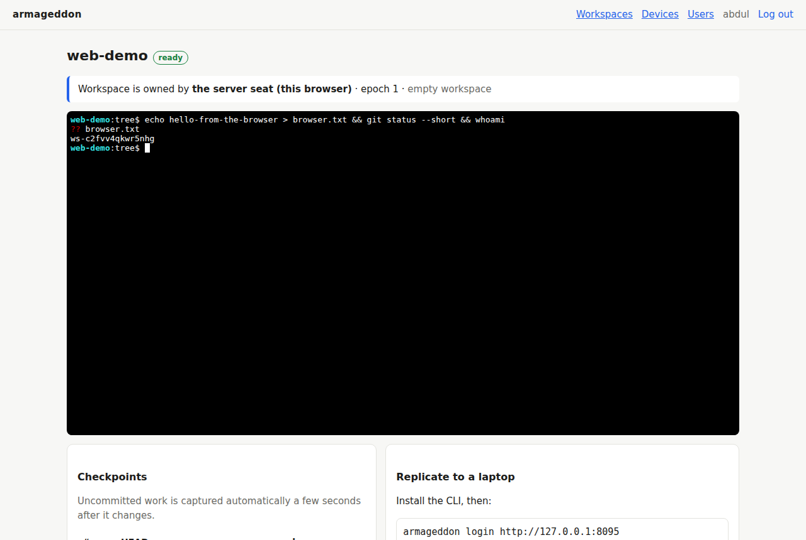

# Armageddon

**Your development environment survives the machine.**

Armageddon is a self-hosted development workspace server. Your code, Git history and *uncommitted* work live on your own server. You work there from a browser, and laptops keep live replicas. If a laptop dies, you lose nothing: open the browser on any machine and continue, or clone the replica again.

> **Status: MVP (v0.1 first slice).** See [`docs/design/`](docs/design/) for the design contract and plan. Everything here runs; the [MVP limits](#mvp-limits) are real.



## How it works

- **The server seat is where you work.** Each workspace has a Git working tree on the server, with a browser terminal. Each workspace runs as its own OS user.
- **Committed history** moves only through Git. The server hosts the canonical repository over smart HTTP.
- **Uncommitted work** is captured as **checkpoints** a couple of seconds after it changes. A checkpoint holds every working-tree file (including `.env`, deliberately), the staged index and HEAD. It's stored in a separate internal repository, so your Git history stays clean.
- **Laptops run follower replicas.** `armageddon clone` gives an exact copy, including uncommitted and staged work. `armageddon follow` keeps it current. Replicas are read-only. If you edit one anyway, your edits are uploaded to the server as a *quarantine* before anything overwrites them; nothing is silently lost.

## Quickstart

```sh
go build -o armageddon ./cmd/armageddon            # Go ≥ 1.24 (the toolchain auto-updates as needed); git ≥ 2.42 on the server
sudo install -m 0755 armageddon /usr/local/bin/

# Server (as root: workspace isolation uses one OS user per workspace)
sudo armageddon server init --data /var/lib/armageddon \
     --listen :8080 --public-url http://your-server:8080
sudo armageddon server run --data /var/lib/armageddon
#   → prints a one-time setup URL: open it to create the first admin.
```

In the browser:
1. Create the admin from the setup URL.
2. Create a workspace, either empty or cloned from a Git URL.
3. Work in its terminal: edit, `git commit`, `git push origin`.

On a laptop:

```sh
armageddon login http://your-server:8080      # approve the device in the browser
armageddon workspaces
armageddon clone <workspace>                  # exact replica, incl. uncommitted work
cd <workspace> && armageddon follow           # keep it current
armageddon status                             # replica health
```

For TLS, pass `--tls-cert/--tls-key` to `server init`, or put the server behind a reverse proxy that supports WebSockets.

## Testing

```sh
go test ./...                       # unit tests
sudo test/e2e/mvp.sh ./armageddon   # MVP acceptance test (root; uses /srv and github.com)
node test/e2e/ui.mjs <setup-url>    # browser test (Playwright + Chromium) against a fresh server
```

The acceptance test runs the north-star scenario on one machine:
- a real server with isolated workspace users;
- edits, staged work and commits on the server seat;
- a paired "laptop" that clones and follows;
- the replica deleted and recovered;
- a quarantined local edit;
- a server restart;
- Git access control.

## MVP limits

- **Replicas are read-only.** Local write mode (taking the lease to your laptop) is milestone M7.
- **The server runs as root** and drops to per-workspace users in-process. The design's separate privileged helper is milestone M3.1.
- **No installer, automatic TLS (ACME) or self-update yet** (M5).
- **No SSH endpoint or code-server yet** (M4). The browser terminal is the server seat's UI.
- **Polling capture:** the server seat is scanned every 2 s. That's fine up to roughly 50k files (see `docs/design/prototypes/P1-capture-perf.md`).
- **Trash refs** (deleted or force-moved branches) are kept in the workspace repository under `refs/armageddon/trash/`, hidden from clients.

## Layout

```
cmd/armageddon/          single binary: server, hooks, agent, CLI
internal/server/         HTTP API, authority, Git hosting, workspaces, terminal, embedded web UI
internal/agent/          device pairing, credential helper, replicas (clone/follow/status)
internal/treesync/       git-shadow checkpoints (capture, thin-pack transport, verified apply)
internal/store/          SQLite persistence and migrations
internal/identity/       argon2id passwords, Ed25519 device challenges
internal/sysuser/        per-workspace OS users (MVP stand-in for the privileged helper)
test/e2e/mvp.sh          acceptance test
docs/design/             design contract, implementation plan, prototype results
```
